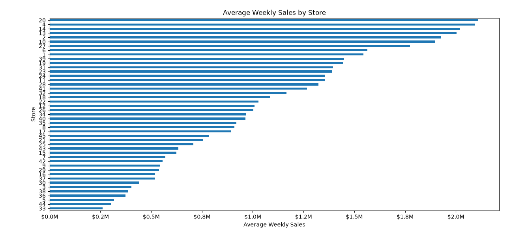
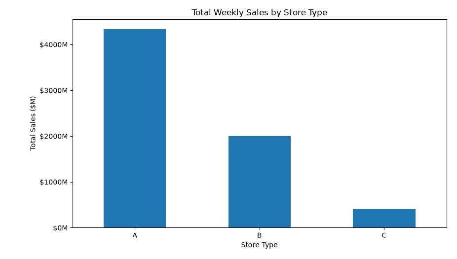
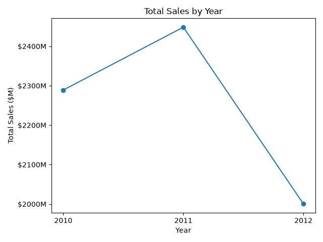
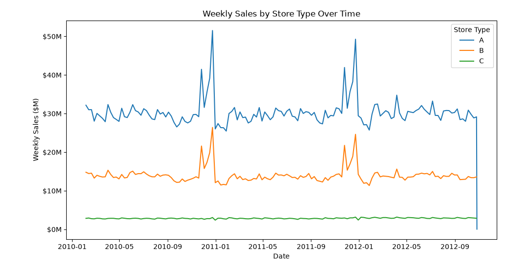
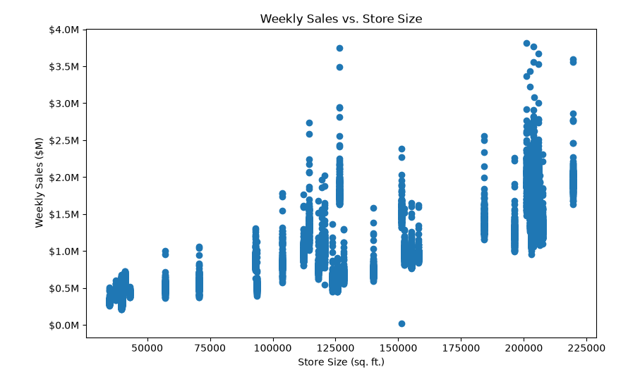
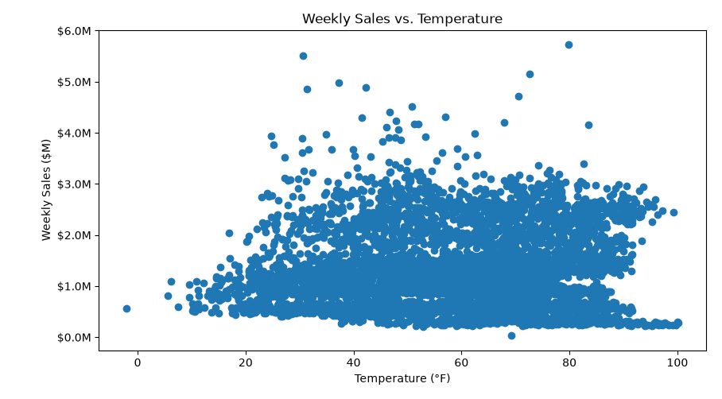
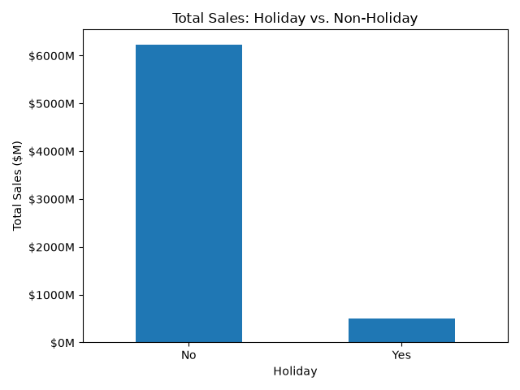

# BI Walmart Data Analysis

## Data Quality Findings & Treatment

| **Finding**                    | **Treatment** |
| ------------------------------ | ------------- |
| Negative `Weekly_Sales`        | **Preserve**  |
| Extremely large `Weekly_Sales` | **Preserve**  |
| NULL Markdown                  | **Preserve**  |
| Negative Markdown              | **Preserve**  |
| NULL CPI/Unemployment          | **Preserve**  |

**Cleaning approach:** Raw source data is preserved unchanged. Technical cleaning and standardization are performed in dbt staging. Values requiring business interpretation are preserved rather than modified or imputed without an established business rule.

## S3 → Snowflake Raw

Uploaded original CSVs to S3:

```text
raw/
├── department/
│   └── department.csv
├── fact/
│   └── fact.csv
└── store/
    └── stores.csv
```

* Created Snowflake `WALMART_DB.RAW` schema, external stages, file format, and raw tables.
* Loaded CSVs using `COPY INTO`.
* Configured `NA` values in `fact.csv` to load as `NULL`.
* Added ingestion metadata using `_ingested_at` and `_file_name`.
* Verified baseline row counts:

  * `DEPARTMENT`: 421,570
  * `FACT`: 8,190
  * `STORE`: 45

### Staging Layer

The staging layer transforms the RAW Walmart data into standardized, incrementally processed datasets for downstream analytical models.

**Models**

* `stg_department` — department-level weekly sales
* `stg_fact` — store-level economic and environmental data
* `stg_store` — store attributes

**Key deliverables**

* Standardized column names and data types.
* Converted source dates to `DATE`.
* Converted source `NA` values to `NULL` where applicable.
* Preserved source business values requiring business interpretation rather than modifying or imputing them without an established rule.
* Implemented incremental dbt models using `_ingested_at` to identify newly ingested RAW records.
* Retained `_ingested_at` and `_file_name` as ingestion metadata.
* Defined source grains:

  * `stg_department`: Store + Dept + Date
  * `stg_fact`: Store + Date
  * `stg_store`: Store

**Design decision:** Staging handles technical standardization and incremental ingestion. It preserves newly ingested records, including re-ingested versions of an existing business key. Business change detection and dimensional/fact-table logic are handled downstream in the analytical layer.

### Analytics Layer

The analytics layer transforms standardized staging data into dimensional and fact models at defined business grains for analytical use.

**Models**

* `Walmart_date_dim` — Date dimension
* `Walmart_store_department_dim` — Store + Department dimension
* `Walmart_fact_snapshot` — Store + Department + Date fact snapshot

**Key deliverables**

* Defined the target grain for each analytical model.
* Validated source grains and join relationships before building downstream models.
* Built `Walmart_date_dim` at Date grain with one row per business date.
* Implemented `Walmart_date_dim` as an incremental SCD Type 1 model.
* Built `Walmart_store_department_dim` at Store + Department grain as an SCD Type 1 dimension.
* Implemented SCD Type 1 logic to:

  * Insert new Store + Department combinations.
  * Update existing dimension records only when attributes change.
  * Leave unchanged records untouched.
* Built `Walmart_fact_snapshot` at Store + Department + Date grain.
* Implemented the fact snapshot using dbt's SCD Type 2 snapshot functionality.
* Used check-based change detection because the source data does not contain a true business `updated_at` timestamp.
* Preserved historical versions of changed fact observations.
* Joined department-level sales with store-level attributes, store/date-level economic data, and the date dimension.
* Established `Store_id`, `Dept_id`, and `Date_id` as dimensional keys in the fact snapshot.
* Preserved NULL and unusual source values in analytical models rather than applying unsupported business assumptions.
* Added dbt tests for analytical model requirements and business grain.
* All analytical model tests passed.

**Design decisions**

* Dimensions contain descriptive attributes and are maintained according to their required change behavior.
* The Store + Department dimension uses SCD Type 1 because the requirement is to maintain the current attribute value rather than historical versions.
* The Date dimension uses incremental SCD Type 1 logic so newly available business dates can be inserted without rebuilding the full table.
* The fact snapshot uses SCD Type 2 because the project requirement is to retain historical versions when an existing Store + Department + Date observation changes.
* Staging uses `_ingested_at` to identify newly ingested records, while the fact snapshot determines whether the latest business-key state has changed.

### Incremental Pipeline

The incremental pipeline simulates the arrival of new source files and validates that newly ingested records flow through RAW, staging, and analytical models without incorrectly duplicating or overwriting historical data.

**Incremental test data**

The incremental department file contained:

* An existing `Store + Dept + Date` observation with changed `Weekly_Sales`:

  * `45 + 98 + 2012-10-26`
  * `Weekly_Sales`: `1076.8 → 806.8`

* A new `Store + Dept + Date` observation:

  * `1 + 1 + 2012-10-27`
  * `Weekly_Sales`: `1050.2`

The incremental fact file contained the corresponding `Store + Date` record for `1 + 2012-10-27`.

**Key deliverables**

* Simulated a subsequent source-system load by adding incremental department and fact CSV files to their respective S3 prefixes.
* Re-ran `COPY INTO` to ingest newly arrived files into Snowflake RAW tables.
* Verified that the incremental records were added without reloading the original source records.
* Verified ingestion metadata using `_file_name` and `_ingested_at`.
* Incrementally processed newly ingested records in the dbt staging models using `_ingested_at` as the ingestion watermark.
* Verified staging row counts increased as expected:

  * `STG_DEPARTMENT`: 421,570 → 421,572
  * `STG_FACT`: 8,190 → 8,191
  * `STG_STORE`: 45 → 45
* Verified that the Date dimension incorporated the new `2012-10-27` business date.
* Verified that the Store + Department SCD Type 1 dimension remained unchanged because the existing business keys and attributes did not change.
* Verified that the fact snapshot captured the new Store + Department + Date observation.
* Verified that the changed `45 + 98 + 2012-10-26` observation produced two SCD Type 2 versions.
* Verified that the previous fact version was closed and the new version remained current.
* Verified that all relevant dates in `STG_DEPARTMENT` exist in the Date dimension.
* Revalidated analytical model counts and grain after the incremental load.

**Incremental behavior validated**

| **Model**                      | **Baseline** | **After Incremental Load** | **Expected Behavior**                                   |
| ------------------------------ | -----------: | -------------------------: | ------------------------------------------------------- |
| `Walmart_date_dim`             |          143 |                        144 | Insert new business date                                |
| `Walmart_store_department_dim` |        3,331 |                      3,331 | No change; existing SCD1 attributes unchanged           |
| `Walmart_fact_snapshot`        |      421,570 |                    421,572 | Capture new observation and changed observation as SCD2 |

**SCD Type 2 change validation**

For `Store 45 + Dept 98 + Date 2012-10-26`, the fact snapshot contained two historical versions:

```text
Store  Dept  Date        Weekly Sales
45     98    2012-10-26  1076.8
45     98    2012-10-26   806.8
```

The original version was closed with `dbt_valid_to`, while the new version remained current with a NULL `dbt_valid_to`.

**Design decision**

Incremental processing is applied according to the role and grain of each model. Staging identifies newly ingested records using `_ingested_at`. Downstream analytical models then determine whether those records represent new dates, new dimension business keys, changed dimension attributes, or changed/new fact observations.

## Visualization & Analytics

The analytics layer was queried from Python using the Snowflake Connector for Python. SQL was used to define the required observation grain and aggregation before the results were visualized with Python and Matplotlib.

### Average Weekly Sales by Store

**Question:** What is the average weekly sales for each store across the available business dates?

**Target observation:** One store.



### Total Sales by Store Type

**Question:** How do total sales compare across Walmart store types?

**Target observation:** One store type.



### Total Sales by Year

**Question:** How do total sales vary by year?

**Target observation:** One year.



### Weekly Sales by Store Type Over Time

**Question:** How do weekly sales for each store type change over time?

**Target observation:** One store type on one business date.



### Weekly Sales vs. Store Size

**Question:** Is there a relationship between store size and weekly sales?

**Target observation:** One store on one business date.



### Weekly Sales vs. Temperature

**Question:** Is there a relationship between temperature and weekly sales?

**Target observation:** One business date.



### Holiday vs. Non-Holiday Sales

**Question:** How do total sales compare between holiday and non-holiday dates?

**Target observation:** One holiday category.



